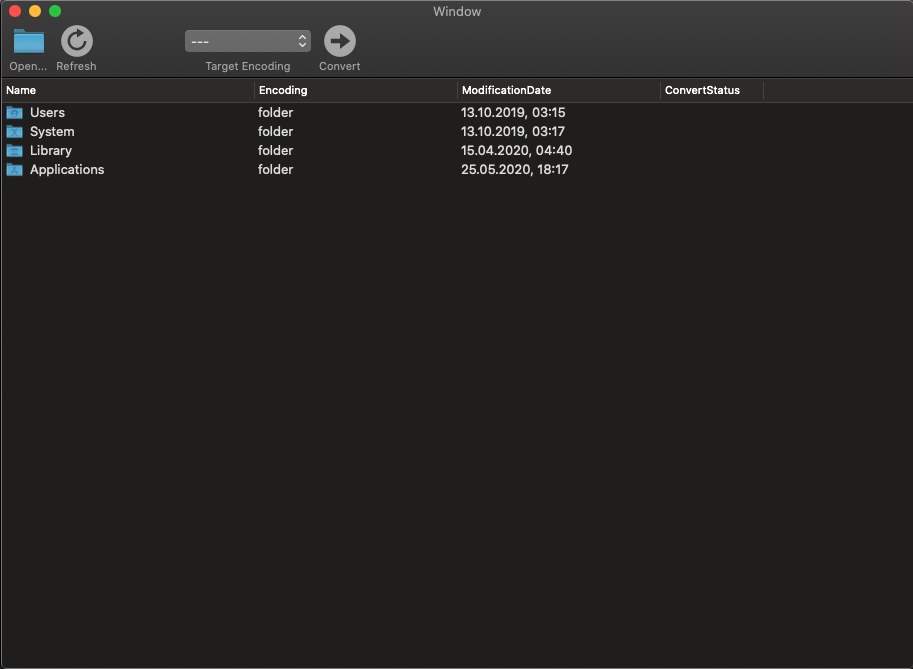
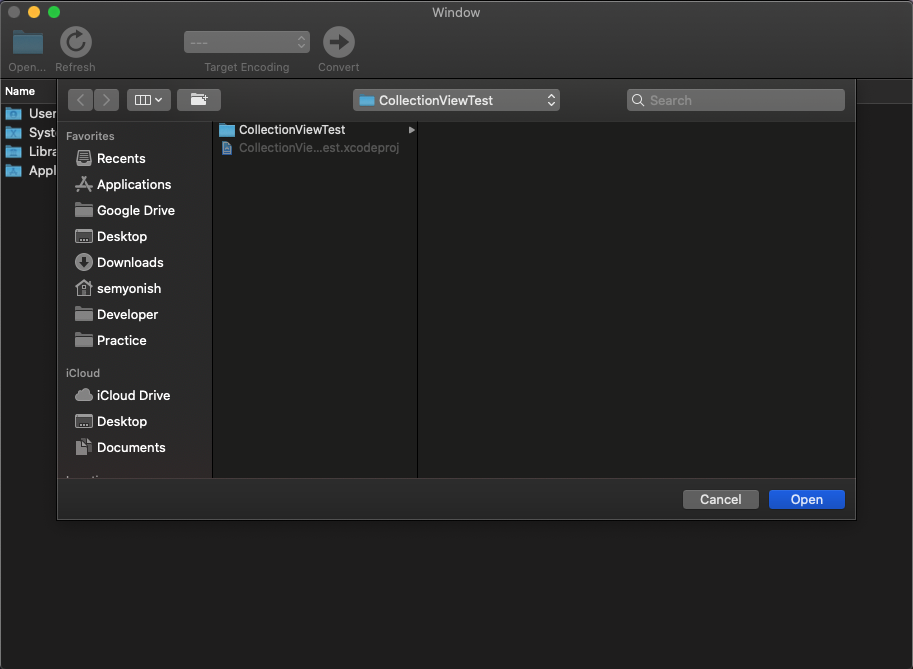
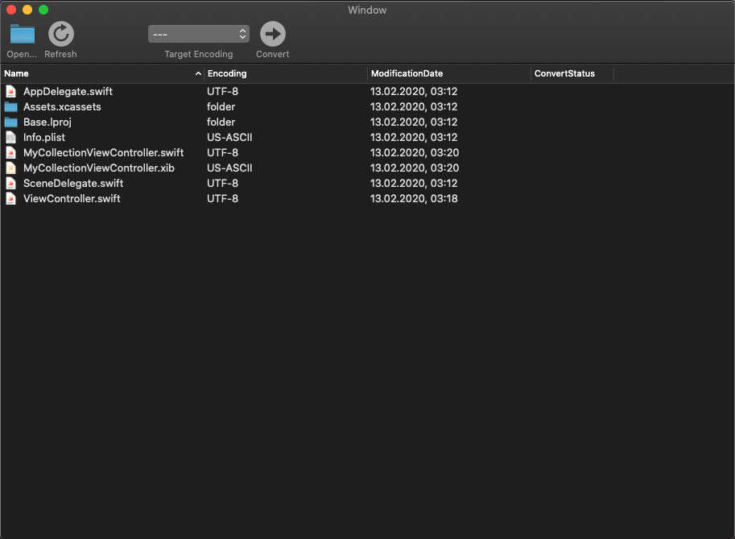
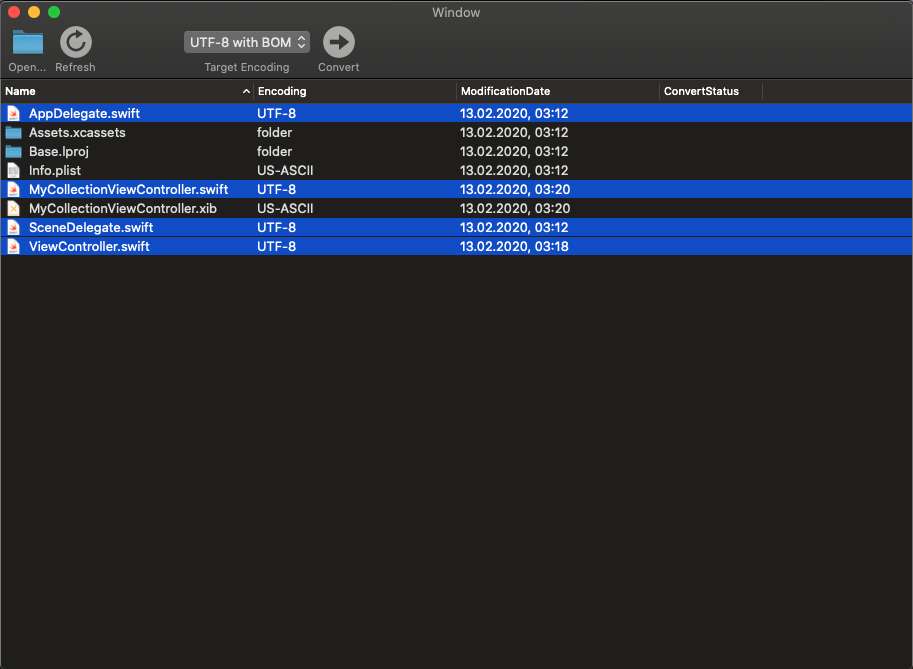
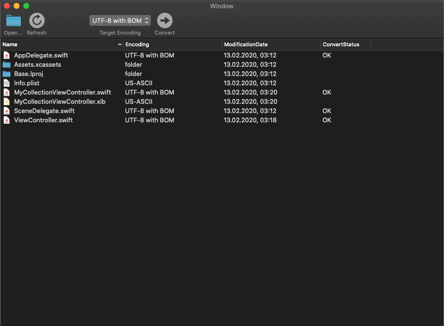

# EncodingConverter
MacOS application with GUI for changing text file encodings.

#### Сurrently available encodings:
- UTF8
- UTF8 with BOM
- US-ASCII
- Windows 1251

## Third-party libraries
- [UniversalDetector](https://cocoapods.org/pods/UniversalDetector)

## CI
2 jobs:
- unit_tests
- build_app (saves built app in job artifacts)

## Guide
#### - Click "Open ..."

#### - Select folder in menu

#### - Select files in list

#### - Select required encoding in Toolbar item "Target Encoding" and click "Convert"

